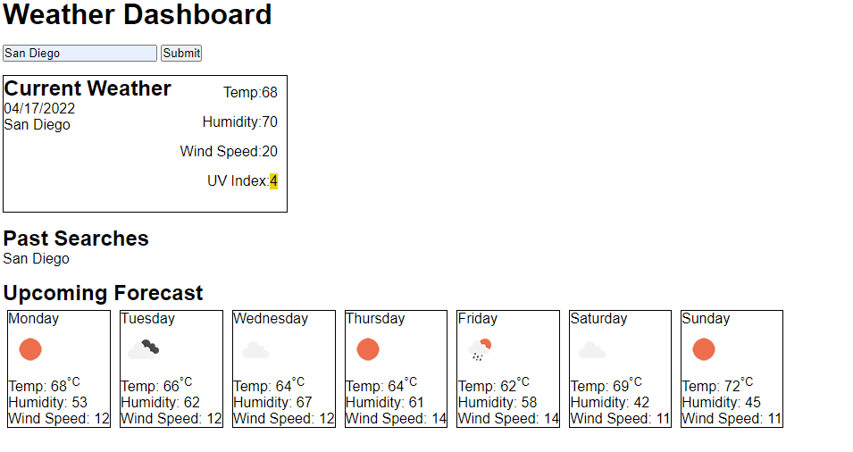

# Weather-Dashboard

## Description

This application is a weather dashboard used to check the forecast for multiplie cities. When you search for a city you are presented with current and future conditions for that city and that city is added to the search history. When you view the UV index you are presented with a color that indicates whether the conditions are favorable (green), moderate (yellow), or severe (red). Weather data is retrieved from the OpenWeather API.

## Built With

- HTML
- CSS
- Javascript

## Website

https://ajpicc3734.github.io/Weather-Dashboard/

## ScreenShot

